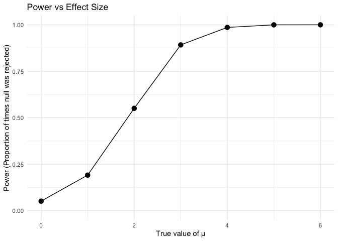
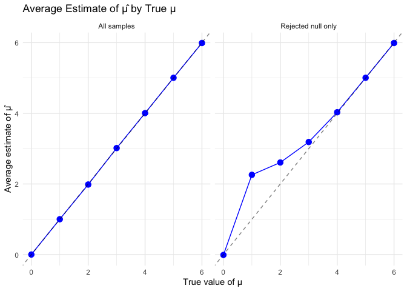

p8105_hw5_ao2965
================
Alissa Shams Orchi
2025-11-14

# Problem 2

``` r
n = 30
sigma = 5
alpha = 0.05
n_sim = 5000

# Simulation function
sim_t_test = function(mu, n = 30, sigma = 5) {
  sim_data = rnorm(n, mean = mu, sd = sigma)
  test = t.test(sim_data, mu = 0)
  broom::tidy(test) |> 
    select(estimate, p.value)
}

sim_mu_0 = map_dfr(1:n_sim, ~ sim_t_test(mu = 0)) |> 
  mutate(mu_true = 0)

sim_mu_1 = map_dfr(1:n_sim, ~ sim_t_test(mu = 1)) |> 
  mutate(mu_true = 1)

sim_mu_2 = map_dfr(1:n_sim, ~ sim_t_test(mu = 2)) |> 
  mutate(mu_true = 2)

sim_mu_3 = map_dfr(1:n_sim, ~ sim_t_test(mu = 3)) |> 
  mutate(mu_true = 3)

sim_mu_4 = map_dfr(1:n_sim, ~ sim_t_test(mu = 4)) |> 
  mutate(mu_true = 4)

sim_mu_5 = map_dfr(1:n_sim, ~ sim_t_test(mu = 5)) |> 
  mutate(mu_true = 5)

sim_mu_6 = map_dfr(1:n_sim, ~ sim_t_test(mu = 6)) |> 
  mutate(mu_true = 6)

sim_results = bind_rows(
  sim_mu_0,
  sim_mu_1,
  sim_mu_2,
  sim_mu_3,
  sim_mu_4,
  sim_mu_5,
  sim_mu_6
)
```

``` r
power_summary = sim_results |> 
  group_by(mu_true) |> 
  summarize(
    power = mean(p.value < 0.05),
    avg_estimate_all = mean(estimate),
    avg_estimate_rejected = mean(estimate[p.value < 0.05]),
    n_simulations = n()
  )

power_summary
```

    ## # A tibble: 7 × 5
    ##   mu_true  power avg_estimate_all avg_estimate_rejected n_simulations
    ##     <dbl>  <dbl>            <dbl>                 <dbl>         <int>
    ## 1       0 0.0484          0.00291              -0.00923          5000
    ## 2       1 0.184           1.00                  2.26             5000
    ## 3       2 0.555           1.98                  2.61             5000
    ## 4       3 0.897           3.02                  3.19             5000
    ## 5       4 0.990           4.01                  4.03             5000
    ## 6       5 1               5.01                  5.01             5000
    ## 7       6 1               5.99                  5.99             5000

``` r
power_plot = power_summary |> 
  ggplot(aes(x = mu_true, y = power)) +
  geom_point(size = 3) +
  geom_line() +
  scale_y_continuous(limits = c(0, 1)) +
  labs(
    title = "Power vs Effect Size",
    x = "True value of μ",
    y = "Power (Proportion of times null was rejected)"
  ) +
  theme_minimal()

power_plot
```

<!-- -->

``` r
estimates_plot = power_summary |> 
  select(mu_true, avg_estimate_all, avg_estimate_rejected) |> 
  pivot_longer(
    cols = starts_with("avg"),
    names_to = "sample_type",
    values_to = "average_estimate"
  ) |> 
  mutate(
    sample_type = case_when(
      sample_type == "avg_estimate_all" ~ "All samples",
      sample_type == "avg_estimate_rejected" ~ "Rejected null only"
    )
  ) |> 
  ggplot(aes(x = mu_true, y = average_estimate)) +
  geom_point(size = 3, color = "blue") +
  geom_line(color = "blue") +
  facet_wrap(~ sample_type, ncol = 2) +  
  labs(
    title = "Average Estimate of μ̂ by True μ",
    x = "True value of μ",
    y = "Average estimate of μ̂"
  ) +
  geom_abline(slope = 1, intercept = 0,   
            linetype = "dashed", alpha = 0.5) +
  theme_minimal()

estimates_plot
```

<!-- -->
